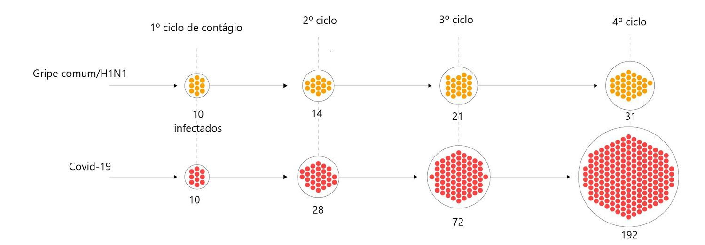

# Trabalho1-Estatística
Author: "GabrielPassos", "GabrielBrilhante"

## Resolução para o trabalho solicitado durante a paralisação da faculdade.

1) Resumindo os dados em 'casos' por dia:

a) avalie a evolução do contágio.

b) Faça gráficos, calcule medias de posição e dispersão e analise.
<br><br>
Como solicitado nesta questão, devemos separar os casos por dia.

## Item A:
A opção que achei mais viável para analisar a evolução do contágio foi obtida criando o seguinte gráfico:
```r
 plot(x = COVID$Day, y = COVID$Cases, axes= FALSE)
 axis(side=1, at=c(1:31))
 axis(side=2, at=seq(0, 15141, by=500))
```
<br>
<b>Concentração de Casos x Dias:</b>


<br>
<b>Explicação do gráfico:</b> 
<br>
Temos o plot gerado pelo código acima, no qual o eixo X representa os dias de infecção no mundo cronologicamente (todos os países entram nesses dias) e no eixo Y possuímos o número de casos de infectados no mundo todo.
<br>
Analisando o gráfico, percebemos que até o dia 15, a concentração de "bolinhas" tende a aumentar exponencialmente, chegando até mesmo ao maior número de casos registrados (15141), (pode ser visto por "bolinhas" cada vez mais escuras na medida que o valor do eixo X tende ao valor 15) mostrando que o número de casos tende a aumentar de forma exponencial até o dia 15 da tabela fornecida. <br> Porém após o dia 15 (pico da epidemia nos países) o número de infectados tende a diminuir, proveniente da resguarda da população e, quem sabe, de medidas tomadas pelo governo. 


## Item B:
# Primeira Parte:
<b>Plot que mostra a concentração de Casos x Dias:</b>
```r
   plot(x = COVID$Day, y = COVID$Cases, axes= FALSE)
   axis(side=1, at=c(1:31))
   axis(side=2, at=seq(0, 15141, by=500))
```

<br>
<b>Plot que mostra o crescimento e decrescimento de Casos x Dias: (mostra muito bem o aumento exponencial até o dia 15 e decrescimento após o dia 15 dito no item A) </b>
```r
   plot(x = COVID$Day, y = COVID$Cases, axes= FALSE, type = "l")
   axis(side=1, at=c(1:31))
   axis(side=2, at=seq(0, 15141, by=500))
```

<br>
<b>Plot que mostra a concentração de Mortes x Dias:</b>
```r
   plot(x = COVID$Day, y = COVID$Deaths, axes= FALSE)
   axis(side=1, at=c(1:31))
   axis(side=2, at=seq(0, 15141, by=50))
```

<br>
<b>Plot que mostra o crescimento e decrescimento de Mortes x Dias:</b>
```r
   plot(x = COVID$Day, y = COVID$Deaths, axes= FALSE, type = "l")
   axis(side=1, at=c(1:31))
   axis(side=2, at=seq(0, 15141, by=50))
```

<br>
<b>Plot que mostra a concentração de Mortes x Ano:</b>
```r
   plot(x = COVID$Year, y = COVID$Deaths, axes= FALSE, type = "l")
   axis(side=1, at=c(2019:2020))
   axis(side=2, at=seq(0, 15141, by=50))
```

<br>
<b>Plot que mostra a concentração de Casos x País: (Por favor, dê um zoom ou visite o link, a quantidade de países é grande, logo o gráfico fica bem largo)</b>
```r
   barplot(COVID$Cases, names.arg = COVID$GeoId)
```

<br>
https://postimg.cc/0M0gVBM6 --> Link para a imagem, com uma resolucão melhor (Clique em "zoom", a qualidade da imagem ficará perfeita).
<br>
<br>
<b>Plot que mostra a concentração de Mortes x País: (Por favor, dê um zoom, a quantidade de países é grande, logo o gráfico fica bem largo)</b>
```r
   barplot(COVID$Deaths, names.arg = COVID$GeoId)
```

<br>
https://postimg.cc/bZkm022r --> Link para a imagem, com uma resolucão melhor (Clique em "zoom", a qualidade da imagem ficará perfeita).
<br>

# Segunda Parte:
<br>
<br>
Em relação ao número de <b>Casos</b>:

```r
   vector_cases <- tapply(COVID_19_geographic_disbtribution_worldwide_2020_03_17$Cases,COVID_19_geographic_disbtribution_worldwide_2020_03_17$DateRep,sum)
```
<br>
Assuma, para todos os exemplos abaixo, que ainda temos o vector_cases armazenado no exemplo acima.
<br>
<br>
<b>Medidas de posição</b>:
<br>
<br>
Média: 2309.731

```r
   mean_cases <- mean(vector_cases)
   mean_cases
   [1] 2309.731
```
Mediana: 1675.5

```r
   median_cases <- median(vector_cases)
   median_cases
   [1] 1675.5
```
Moda: 0

```r
   getmode <- function(v){
      uniqv <- unique(v)
      uniqv[which.max(tabulate(match(v, uniqv)))]
   }
   mode_cases <- getmode(vector_cases)
   mode_cases
   2020-01-01 
       0 
```
<b>Explicando melhor a função da moda:</b>
<br>
<br>
De dentro para fora:
<b>match(X,unicoX)</b> -> Retorna um vetor dizendo a posição da primeira ocorrência de um elemento do vetor X no unicoX (Elementos do x sem repetição).
Ex:

```r
x = [0 0 0 0 0 0 1 2 3 0 0 0 3]
unicoX = [0 1 2 3]
Ex <- match(X,unicoX)
Ex
[1] 1 1 1 1 1 1 2 3 4 1 1 1 4
```
<b>tabulate(match(X,unicoX)</b> --> Conta o número de ocorrências de cada elemento distinto no vetor criado por match(X,unicoX).
Ex:

```r
Assuma que ainda temos o vetor "Ex", do exemplo passado.
Ex
[1] 1 1 1 1 1 1 2 3 4 1 1 1 4
Ex2 <- tabulate(Ex)
Ex2
[1] 9 1 1 2
```
Isso nos mostra que o número 1 se repetiu 9 vezes, o 2 se repetiu 1 vez, assim como o 3 e o 4 se repetiram 2 vezes cada.
<b>which.max(tabulate(match(X,unicoX))</b> --> Retorna a posição do elemento maximal do vetor criado por tabulate(match(X,unicoX)).
Ex:

```r
Assuma que ainda temos o vetor "Ex2", do exemplo passado.
Ex2
[1] 9 1 1 2
Ex3 <- which.max(Ex2)
Ex3
[1] 1
```
Isso nos mostra que o maximal (9), que representa o número que mais se repetiu no vetor criado pelo comando match() (que contou a repetição de cada elemento distinto), logo o elemento que mais se repetiu (moda) aparece pela primeira vez na posição 1 do vetor x. Logo a moda nesse caso seria x[1] = 0.
<br>
<br>
<b>Medidas de dispersão</b>:
<br>
<br>
Amplitude: 
<br>
Com um calculo simples obtive a amplitude --> A = CasesMax - CasesMin = 16051 - 0 = 16051
Variância: 10282559

```r
   variancia_cases <- var(vector_cases)
   variancia_cases
   [1] 10282559
```
Desvio Padrão: 3206.643
```r
   dp_cases <- sd(vector_cases)
   dp_cases
   [1] 3206.643
```
Em relação ao número de <b>Mortes</b>:

```r 
   vector_deaths <- casos.dia=tapply(COVID_19_geographic_disbtribution_worldwide_2020_03_17$Deaths,COVID_19_geographic_disbtribution_worldwide_2020_03_17$DateRep,sum) 
```
<br>
Assuma, para todos os exemplos abaixo, que ainda temos o vector_deaths.
<br>
<br>
<b>Medidas de posição</b>:
<br>
<br>
Média: 91.0641

```r
   mean_deaths <- mean(vector_deaths)
   mean_deaths
   [1] 91.0641
```
Mediana: 61

```r
   median_deaths <- mean(vector_deaths)
   median_deaths
   [1] 61
```
Moda: 0

```r
   CalcularModa <- function(X){
      unicoX <- unique(X)
      unicoX[which.max(tabulate(match(X, unicoX)))]
   }
   mode_deaths <- CalcularModa(vector_deaths)
   mode_deaths
   [1] 0
```
<b>Medidas de dispersão</b>:
<br>
Amplitude:
Com um calculo simples obtive a amplitude --> A = CasesMax - CasesMin = 746 - 0 = 746
Variância: 17611.62

```r
   variancia_deaths <- var(vector_deaths)
   variancia_deaths
   [1] 17611.62
```
Desvio Padrão: 132.7088

```r
   dp_deaths <- sd(vector_deaths)
   dp_deaths
   [1] 132.7088
```
2) Considere o número de casos de COVID-19 por país, e os dados sobre a idade média da população de cada país, existe uma correlação entre idade da população e número de contágios?

Lista dos países com populações mais velhas: https://en.wikipedia.org/wiki/List_of_countries_by_median_age

## Resposta

Visando organizar o número de caso por <b>País</b>, realizei o comando "aggregate()" que agrega os valores de colunas em uma tabela (da qual as colunas representam os valores solicitados, no caso a soma dos casos, dado pela "FUN = sum" em relação aos países), como mostrado abaixo:
```r
   CasosPorPais <- aggregate(x=COVID$Cases,
                 by = list(COVID$`Countries and territories`),
                 FUN = sum)
   CasosPorPais
```
Temos o seguinte output:
```r
   ##                                        Group.1     x
   ## 1                                  Afghanistan    21
   ## 2                                      Albania    51
   ## 3                                      Algeria    60
   ## 4                                      Andorra    14
   ## 5                          Antigua_and_Barbuda     1
   ## 6                                    Argentina    65
   ## 7                                      Armenia    52
   ## 8                                    Australia   375
   ## 9                                      Austria  1016
   ## 10                                  Azerbaijan    19
   ## 11                                     Bahamas     1
   ## 12                                     Bahrain   221
   ## 13                                  Bangladesh     5
   ## 14                                     Belarus    36
   ## 15                                     Belgium  1085
   ## 16                                       Benin     1
   ## 17                                      Bhutan     1
   ## 18                                     Bolivia    11
   ## 19                      Bosnia_and_Herzegovina    21
   ## 20                                      Brazil   234
   ## 21                           Brunei_Darussalam    54
   ## 22                                    Bulgaria    62
   ## 23                                Burkina_Faso    20
   ## 24                                    Cambodia    24
   ## 25                                    Cameroon     4
   ## 26                                      Canada   424
   ## 27  Cases_on_an_international_conveyance_Japan   696
   ## 28                    Central_African_Republic     1
   ## 29                                       Chile   156
   ## 30                                       China 81130
   ## 31                                    Colombia    57
   ## 32                                       Congo     1
   ## 33                                  Costa_Rica    41
   ## 34                                Cote_dIvoire     5
   ## 35                                     Croatia    56
   ## 36                                        Cuba     4
   ## 37                                      Cyprus    40
   ## 38                              Czech_Republic   344
   ## 39            Democratic_Republic_of_the_Congo     3
   ## 40                                     Denmark   932
   ## 41                          Dominican_Republic    11
   ## 42                                     Ecuador    58
   ## 43                                       Egypt   126
   ## 44                           Equatorial_Guinea     1
   ## 45                                     Estonia   205
   ## 46                                    Eswatini     1
   ## 47                                    Ethiopia     5
   ## 48                                     Finland   272
   ## 49                                      France  6633
   ## 50                                       Gabon     1
   ## 51                                     Georgia    33
   ## 52                                     Germany  6012
   ## 53                                       Ghana     6
   ## 54                                      Greece   352
   ## 55                                   Guatemala     6
   ## 56                                      Guinea     1
   ## 57                                      Guyana     4
   ## 58                                    Holy_See     1
   ## 59                                    Honduras     8
   ## 60                                     Hungary    50
   ## 61                                     Iceland   199
   ## 62                                       India   125
   ## 63                                   Indonesia   134
   ## 64                                        Iran 14991
   ## 65                                        Iraq   124
   ## 66                                     Ireland   223
   ## 67                                      Israel   260
   ## 68                                       Italy 27980
   ## 69                                     Jamaica    10
   ## 70                                       Japan   824
   ## 71                                      Jordan    16
   ## 72                                  Kazakhstan    11
   ## 73                                       Kenya     3
   ## 74                                      Kosovo     2
   ## 75                                      Kuwait   123
   ## 76                                      Latvia    36
   ## 77                                     Lebanon   120
   ## 78                                     Liberia     1
   ## 79                               Liechtenstein     7
   ## 80                                   Lithuania    17
   ## 81                                  Luxembourg    81
   ## 82                                    Malaysia   553
   ## 83                                    Maldives    13
   ## 84                                       Malta    30
   ## 85                                  Mauritania     1
   ## 86                                      Mexico    82
   ## 87                                     Moldova    29
   ## 88                                      Monaco     9
   ## 89                                    Mongolia     1
   ## 90                                     Morocco    37
   ## 91                                     Myanmar     0
   ## 92                                     Namibia     2
   ## 93                                       Nepal     1
   ## 94                                 Netherlands  1413
   ## 95                                 New_Zealand     8
   ## 96                                     Nigeria     2
   ## 97                             North_Macedonia    19
   ## 98                                      Norway  1169
   ## 99                                        Oman    24
   ## 100                                   Pakistan   187
   ## 101                                  Palestine    39
   ## 102                                     Panama    69
   ## 103                                   Paraguay     9
   ## 104                                       Peru    86
   ## 105                                Philippines   142
   ## 106                                     Poland   177
   ## 107                                   Portugal   331
   ## 108                                      Qatar   439
   ## 109                                    Romania   184
   ## 110                                     Russia    93
   ## 111                                     Rwanda     5
   ## 112                                Saint_Lucia     2
   ## 113           Saint_Vincent_and_the_Grenadines     1
   ## 114                                 San_Marino   102
   ## 115                               Saudi_Arabia   133
   ## 116                                    Senegal    27
   ## 117                                     Serbia    57
   ## 118                                 Seychelles     4
   ## 119                                  Singapore   243
   ## 120                                   Slovakia    84
   ## 121                                   Slovenia   253
   ## 122                                    Somalia     1
   ## 123                               South_Africa    62
   ## 124                                South_Korea  8320
   ## 125                                      Spain  9191
   ## 126                                  Sri_Lanka    29
   ## 127                                      Sudan     1
   ## 128                                   Suriname     1
   ## 129                                     Sweden  1121
   ## 130                                Switzerland  2200
   ## 131                                     Taiwan    67
   ## 132                                   Thailand   177
   ## 133                                       Togo     1
   ## 134                        Trinidad_and_Tobago     5
   ## 135                                    Tunisia    20
   ## 136                                     Turkey    47
   ## 137                                    Ukraine     5
   ## 138                       United_Arab_Emirates    98
   ## 139                             United_Kingdom  1543
   ## 140                United_Republic_of_Tanzania     1
   ## 141                   United_States_of_America  4661
   ## 142                                    Uruguay    29
   ## 143                                 Uzbekistan     8
   ## 144                                  Venezuela    33
   ## 145                                    Vietnam    61
```
Porém, como estamos interessados nos países com o maior número de casos, temos que inverter esse output. Para isso, o comando utilizado foi:
```r
   CasosPorPais <- CasosPorPais[order(CasosPorPais[,2]), TRUE]
```
Que ordena a tabela por número de casos de forma crescente ("CasosPorPais" pela coluna 2, no caso o x). Porém, ainda estamos com o maior número de casos no fim da tabela. Para ordenar de forma decrescente o comando utilizado foi:
```r
   CasosPorPais <- CasosPorPais[order(x, decreasing = TRUE),]
   CasosPorPais
                                          Group.1     x
   30                                       China 81130
   68                                       Italy 27980
   64                                        Iran 14991
   125                                      Spain  9191
   124                                South_Korea  8320
   49                                      France  6633
   52                                     Germany  6012
   141                   United_States_of_America  4661
   130                                Switzerland  2200
   139                             United_Kingdom  1543
   94                                 Netherlands  1413
   98                                      Norway  1169
   129                                     Sweden  1121
   15                                     Belgium  1085
   9                                      Austria  1016
   40                                     Denmark   932
   70                                       Japan   824
   27  Cases_on_an_international_conveyance_Japan   696
   82                                    Malaysia   553
   108                                      Qatar   439
   26                                      Canada   424
   8                                    Australia   375
   54                                      Greece   352
   38                              Czech_Republic   344
   107                                   Portugal   331
   48                                     Finland   272
   67                                      Israel   260
   121                                   Slovenia   253
   119                                  Singapore   243
   20                                      Brazil   234
   66                                     Ireland   223
   12                                     Bahrain   221
   45                                     Estonia   205
   61                                     Iceland   199
   100                                   Pakistan   187
   109                                    Romania   184
   106                                     Poland   177
   132                                   Thailand   177
   29                                       Chile   156
   105                                Philippines   142
   63                                   Indonesia   134
   115                               Saudi_Arabia   133
   43                                       Egypt   126
   62                                       India   125
   65                                        Iraq   124
   75                                      Kuwait   123
   77                                     Lebanon   120
   114                                 San_Marino   102
   138                       United_Arab_Emirates    98
   110                                     Russia    93
   104                                       Peru    86
   120                                   Slovakia    84
   86                                      Mexico    82
   81                                  Luxembourg    81
   102                                     Panama    69
   131                                     Taiwan    67
   6                                    Argentina    65
   22                                    Bulgaria    62
   123                               South_Africa    62
   145                                    Vietnam    61
   3                                      Algeria    60
   42                                     Ecuador    58
   31                                    Colombia    57
   117                                     Serbia    57
   35                                     Croatia    56
   21                           Brunei_Darussalam    54
   7                                      Armenia    52
   2                                      Albania    51
   60                                     Hungary    50
   136                                     Turkey    47
   33                                  Costa_Rica    41
   37                                      Cyprus    40
   101                                  Palestine    39
   90                                     Morocco    37
   14                                     Belarus    36
   76                                      Latvia    36
   51                                     Georgia    33
   144                                  Venezuela    33
   84                                       Malta    30
   87                                     Moldova    29
   126                                  Sri_Lanka    29
   142                                    Uruguay    29
   116                                    Senegal    27
   24                                    Cambodia    24
   99                                        Oman    24
   1                                  Afghanistan    21
   19                      Bosnia_and_Herzegovina    21
   23                                Burkina_Faso    20
   135                                    Tunisia    20
   10                                  Azerbaijan    19
   97                             North_Macedonia    19
   80                                   Lithuania    17
   71                                      Jordan    16
   4                                      Andorra    14
   83                                    Maldives    13
   18                                     Bolivia    11
   41                          Dominican_Republic    11
   72                                  Kazakhstan    11
   69                                     Jamaica    10
   88                                      Monaco     9
   103                                   Paraguay     9
   59                                    Honduras     8
   95                                 New_Zealand     8
   143                                 Uzbekistan     8
   79                               Liechtenstein     7
   53                                       Ghana     6
   55                                   Guatemala     6
   13                                  Bangladesh     5
   34                                Cote_dIvoire     5
   47                                    Ethiopia     5
   111                                     Rwanda     5
   134                        Trinidad_and_Tobago     5
   137                                    Ukraine     5
   25                                    Cameroon     4
   36                                        Cuba     4
   57                                      Guyana     4
   118                                 Seychelles     4
   39            Democratic_Republic_of_the_Congo     3
   73                                       Kenya     3
   74                                      Kosovo     2
   92                                     Namibia     2
   96                                     Nigeria     2
   112                                Saint_Lucia     2
   5                          Antigua_and_Barbuda     1
   11                                     Bahamas     1
   16                                       Benin     1
   17                                      Bhutan     1
   28                    Central_African_Republic     1
   32                                       Congo     1
   44                           Equatorial_Guinea     1
   46                                    Eswatini     1
   50                                       Gabon     1
   56                                      Guinea     1
   58                                    Holy_See     1
   78                                     Liberia     1
   85                                  Mauritania     1
   89                                    Mongolia     1
   93                                       Nepal     1
   113           Saint_Vincent_and_the_Grenadines     1
   122                                    Somalia     1
   127                                      Sudan     1
   128                                   Suriname     1
   133                                       Togo     1
   140                United_Republic_of_Tanzania     1
   91                                     Myanmar     0
```
Porém ainda não possuimos a idade média dos países. Para isso, baixei a tabela que o professor disponibilizou no enunciado da questão e juntei com a tabela "CasosPorPais", através do comando abaixo:
```r
   
   IdadePorPais <- IdadeMedia$Median (Tabela do wikipedia)
   Juncao = merge(CasosPorPais, IdadePorPais, by="Group.1", all.x = TRUE) (all.x prevalece a tabela inicial "CasosPorPais", somente adicionando as intercessões das tabelas)
   Juncao
                                          Group.1   x.x  x.y
   30                                       China 81130 37.4
   68                                       Italy 27980 45.5
   64                                        Iran 14991 30.3
   125                                      Spain  9191 42.7
   124                                South_Korea  8320 41.8
   49                                      France  6633 41.4
   52                                     Germany  6012 47.1
   141                   United_States_of_America  4661 38.1
   130                                Switzerland  2200 42.4
   139                             United_Kingdom  1543 40.5
   94                                 Netherlands  1413 42.6
   98                                      Norway  1169 39.2
   129                                     Sweden  1121 41.2
   15                                     Belgium  1085 41.4
   9                                      Austria  1016 44.0
   40                                     Denmark   932 42.2
   70                                       Japan   824 47.3
   27  Cases_on_an_international_conveyance_Japan   696 40.0
   82                                    Malaysia   553 28.5
   108                                      Qatar   439 33.2
   26                                      Canada   424 42.2
   8                                    Australia   375 38.7
   54                                      Greece   352 44.5
   38                              Czech_Republic   344 42.1
   107                                   Portugal   331 42.2
   48                                     Finland   272 42.5
   67                                      Israel   260 29.9
   121                                   Slovenia   253 44.5
   119                                  Singapore   243 34.6
   20                                      Brazil   234 32.0
   66                                     Ireland   223 36.8
   12                                     Bahrain   221 32.3
   45                                     Estonia   205 42.7
   61                                     Iceland   199 36.5
   100                                   Pakistan   187 23.8
   109                                    Romania   184 41.1
   106                                     Poland   177 40.7
   132                                   Thailand   177 37.7
   29                                       Chile   156 34.4
   105                                Philippines   142 23.5
   63                                   Indonesia   134 30.2
   115                               Saudi_Arabia   133 27.5
   43                                       Egypt   126 23.9
   62                                       India   125 27.9
   65                                        Iraq   124 20.0
   75                                      Kuwait   123 29.3
   77                                     Lebanon   120 30.5
   114                                 San_Marino   102 44.4
   138                       United_Arab_Emirates    98 30.3
   110                                     Russia    93 39.6
   104                                       Peru    86 28.0
   120                                   Slovakia    84 40.5
   86                                      Mexico    82 28.3
   81                                  Luxembourg    81 39.3
   102                                     Panama    69 29.2
   131                                     Taiwan    67 40.7
   6                                    Argentina    65 31.7
   22                                    Bulgaria    62 42.7
   123                               South_Africa    62 27.1
   145                                    Vietnam    61 30.5
   3                                      Algeria    60 28.1
   42                                     Ecuador    58 27.7
   31                                    Colombia    57 30.0
   117                                     Serbia    57 42.6
   35                                     Croatia    56 43.0
   21                           Brunei_Darussalam    54 30.2
   7                                      Armenia    52 35.1
   2                                      Albania    51 32.9
   60                                     Hungary    50 42.3
   136                                     Turkey    47 30.9
   33                                  Costa_Rica    41 31.3
   37                                      Cyprus    40 36.8
   101                                  Palestine    39 33.4
   90                                     Morocco    37 29.3
   14                                     Belarus    36 40.0
   76                                      Latvia    36 43.6
   51                                     Georgia    33 38.1
   144                                  Venezuela    33 28.3
   84                                       Malta    30 41.8
   87                                     Moldova    29 36.7
   126                                  Sri_Lanka    29 32.8
   142                                    Uruguay    29 35.0
   116                                    Senegal    27 18.8
   24                                    Cambodia    24 25.3
   99                                        Oman    24 25.6
   1                                  Afghanistan    21 18.8
   19                      Bosnia_and_Herzegovina    21 42.1
   23                                Burkina_Faso    20 17.3
   135                                    Tunisia    20 31.6
   10                                  Azerbaijan    19 31.3
   97                             North_Macedonia    19 37.9
   80                                   Lithuania    17 43.7
   71                                      Jordan    16 22.5
   4                                      Andorra    14 44.3
   83                                    Maldives    13 28.2
   18                                     Bolivia    11 24.3
   41                          Dominican_Republic    11 28.1
   72                                  Kazakhstan    11 30.6
   69                                     Jamaica    10 26.0
   88                                      Monaco     9 53.1
   103                                   Paraguay     9 28.2
   59                                    Honduras     8 23.0
   95                                 New_Zealand     8 37.9
   143                                 Uzbekistan     8 28.6
   79                               Liechtenstein     7 43.2
   53                                       Ghana     6 21.1
   55                                   Guatemala     6 22.1
   13                                  Bangladesh     5 26.7
   34                                Cote_dIvoire     5 36.5
   47                                    Ethiopia     5 17.9
   111                                     Rwanda     5 19.0
   134                        Trinidad_and_Tobago     5 36.0
   137                                    Ukraine     5 40.6
   25                                    Cameroon     4 18.5
   36                                        Cuba     4 41.5
   57                                      Guyana     4 26.2
   118                                 Seychelles     4 35.4
   39            Democratic_Republic_of_the_Congo     3 19.7
   73                                       Kenya     3 19.7
   74                                      Kosovo     2 29.1
   92                                     Namibia     2 21.2
   96                                     Nigeria     2 18.4
   112                                Saint_Lucia     2 34.8
   5                          Antigua_and_Barbuda     1 31.9
   11                                     Bahamas     1 32.0
   16                                       Benin     1 18.2
   17                                      Bhutan     1 27.6
   28                    Central_African_Republic     1 19.7
   32                                       Congo     1 19.7
   44                           Equatorial_Guinea     1 19.8
   46                                    Eswatini     1 21.7
   50                                       Gabon     1 18.6
   56                                      Guinea     1 18.9
   58                                    Holy_See     1 23.0
   78                                     Liberia     1 17.8
   85                                  Mauritania     1 20.5
   89                                    Mongolia     1 28.3
   93                                       Nepal     1 24.1
   113           Saint_Vincent_and_the_Grenadines     1 33.6
   122                                    Somalia     1 18.1
   127                                      Sudan     1 19.9
   128                                   Suriname     1 29.8
   133                                       Togo     1 19.8
   140                United_Republic_of_Tanzania     1 17.7
   91                                     Myanmar     0 17.2


```
Agora sim podemos analisar a influência da idade média em relação ao número de casos nos países. Sabendo que a idade média mundial é de 30.4 anos, todos os países mais afetados pelo COVID-19 estão acima da média mundial, com excessão do Irã, que tem 30,3, quase a média. Porém, analisando melhor, os países que estão sendo mais afetados são exatamente aqueles que têm uma população com a idade média acima de 40 anos, já aqueles que têm uma idade média abaixo de 30 anos estão sendo pouco afetados.
<br>


3) Sobre a mortalidade:

a) Qual a taxa de mortalidade por país e geral?

b) Repita a análise (2) mas considerando mortes.

## Item A:
Primeiro temos que extrair dados sobre a população de cada local e colocar na tabela WorldPopulation. 
   https://en.wikipedia.org/wiki/List_of_countries_and_dependencies_by_population

Agora temos que calcular a taxa de mortalidade, mas antes pegaremos o número de mortes em cada país:

```r
   MortesPorPais <- aggregate(x=COVID$Deaths, by = list(COVID$`Countries and territories`), FUN = sum)

   MortesPorPais

                                        Group.1    x
   1                                  Afghanistan    0
   2                                      Albania    1
   3                                      Algeria    4
   4                                      Andorra    0
   5                          Antigua_and_Barbuda    0
   6                                    Argentina    2
   7                                      Armenia    0
   8                                    Australia    5
   9                                      Austria    3
   10                                  Azerbaijan    0
   11                                     Bahamas    0
   12                                     Bahrain    1
   13                                  Bangladesh    0
   14                                     Belarus    0
   15                                     Belgium    5
   16                                       Benin    0
   17                                      Bhutan    0
   18                                     Bolivia    0
   19                      Bosnia_and_Herzegovina    0
   20                                      Brazil    0
   21                           Brunei_Darussalam    0
   22                                    Bulgaria    2
   23                                Burkina_Faso    0
   24                                    Cambodia    0
   25                                    Cameroon    0
   26                                      Canada    4
   27  Cases_on_an_international_conveyance_Japan    7
   28                    Central_African_Republic    0
   29                                       Chile    0
   30                                       China 3226
   31                                    Colombia    0
   32                                       Congo    0
   33                                  Costa_Rica    0
   34                                Cote_dIvoire    0
   35                                     Croatia    0
   36                                        Cuba    0
   37                                      Cyprus    0
   38                              Czech_Republic    0
   39            Democratic_Republic_of_the_Congo    0
   40                                     Denmark    1
   41                          Dominican_Republic    0
   42                                     Ecuador    2
   43                                       Egypt    2
   44                           Equatorial_Guinea    0
   45                                     Estonia    0
   46                                    Eswatini    0
   47                                    Ethiopia    0
   48                                     Finland    0
   49                                      France  148
   50                                       Gabon    0
   51                                     Georgia    0
   52                                     Germany   13
   53                                       Ghana    0
   54                                      Greece    4
   55                                   Guatemala    1
   56                                      Guinea    0
   57                                      Guyana    1
   58                                    Holy_See    0
   59                                    Honduras    0
   60                                     Hungary    1
   61                                     Iceland    0
   62                                       India    3
   63                                   Indonesia    5
   64                                        Iran  853
   65                                        Iraq    9
   66                                     Ireland    2
   67                                      Israel    0
   68                                       Italy 2158
   69                                     Jamaica    0
   70                                       Japan   28
   71                                      Jordan    0
   72                                  Kazakhstan    0
   73                                       Kenya    0
   74                                      Kosovo    0
   75                                      Kuwait    0
   76                                      Latvia    0
   77                                     Lebanon    3
   78                                     Liberia    0
   79                               Liechtenstein    0
   80                                   Lithuania    0
   81                                  Luxembourg    1
   82                                    Malaysia    0
   83                                    Maldives    0
   84                                       Malta    0
   85                                  Mauritania    0
   86                                      Mexico    0
   87                                     Moldova    0
   88                                      Monaco    0
   89                                    Mongolia    0
   90                                     Morocco    1
   91                                     Myanmar    0
   92                                     Namibia    0
   93                                       Nepal    0
   94                                 Netherlands   24
   95                                 New_Zealand    0
   96                                     Nigeria    0
   97                             North_Macedonia    0
   98                                      Norway    3
   99                                        Oman    0
   100                                   Pakistan    0
   101                                  Palestine    0
   102                                     Panama    1
   103                                   Paraguay    0
   104                                       Peru    0
   105                                Philippines   12
   106                                     Poland    4
   107                                   Portugal    0
   108                                      Qatar    0
   109                                    Romania    0
   110                                     Russia    0
   111                                     Rwanda    0
   112                                Saint_Lucia    0
   113           Saint_Vincent_and_the_Grenadines    0
   114                                 San_Marino    9
   115                               Saudi_Arabia    0
   116                                    Senegal    0
   117                                     Serbia    0
   118                                 Seychelles    0
   119                                  Singapore    0
   120                                   Slovakia    0
   121                                   Slovenia    0
   122                                    Somalia    0
   123                               South_Africa    0
   124                                South_Korea   81
   125                                      Spain  309
   126                                  Sri_Lanka    0
   127                                      Sudan    1
   128                                   Suriname    0
   129                                     Sweden    7
   130                                Switzerland   14
   131                                     Taiwan    1
   132                                   Thailand    1
   133                                       Togo    0
   134                        Trinidad_and_Tobago    0
   135                                    Tunisia    0
   136                                     Turkey    0
   137                                    Ukraine    0
   138                       United_Arab_Emirates    0
   139                             United_Kingdom   55
   140                United_Republic_of_Tanzania    0
   141                   United_States_of_America   85
   142                                    Uruguay    0
   143                                 Uzbekistan    0
   144                                  Venezuela    0
   145                                    Vietnam    0

```

Após isso, podemos calcular a taxa de mortalidade por meio de um loop 'for', e organizá-las:

```r

   Auxiliar <- 1:145

   for(i in 1:145) {
      Auxiliar[i] <- (MortesPorPais$x[i] * 1000)/WorldPopulation$Population[i]
   }

   TaxaDeMortalidade <- cbind(WorldPopulation$`Countries and Territories`, Auxiliar)

   TaxaDeMortalidade

                                                  Auxiliar              
   [1,] "Afghanistan"                                "0"                   
   [2,] "Albania"                                    "0.00034935388745285" 
   [3,] "Algeria"                                    "9.30232558139535e-05"
   [4,] "Andorra"                                    "0"                   
   [5,] "Antigua_and_Barbuda"                        "0"                   
   [6,] "Argentina"                                  "4.45050583559226e-05"
   [7,] "Armenia"                                    "0"                   
   [8,] "Australia"                                  "0.000194885578778987"
   [9,] "Austria"                                    "0.000336980208029115"
   [10,] "Azerbaijan"                                 "0"                   
   [11,] "Bahamas"                                    "0"                   
   [12,] "Bahrain"                                    "0.000647962159009914"
   [13,] "Bangladesh"                                 "0"                   
   [14,] "Belarus"                                    "0"                   
   [15,] "Belgium"                                    "0.000433860033629359"
   [16,] "Benin"                                      "0"                   
   [17,] "Bhutan"                                     "0"                   
   [18,] "Bolivia"                                    "0"                   
   [19,] "Bosnia_and_Herzegovina"                     "0"                   
   [20,] "Brazil"                                     "0"                   
   [21,] "Brunei_Darussalam"                          "0"                   
   [22,] "Bulgaria"                                   "0.00028571269388642" 
   [23,] "Burkina_Faso"                               "0"                   
   [24,] "Cambodia"                                   "0"                   
   [25,] "Cameroon"                                   "0"                   
   [26,] "Canada"                                     "0.000105350304775798"
   [27,] "Cases_on_an_international_conveyance_Japan" "0.10636196496133"    
   [28,] "Central_African_Republic"                   "0"                   
   [29,] "Chile"                                      "0"                   
   [30,] "China"                                      "0.00230116356131325" 
   [31,] "Colombia"                                   "0"                   
   [32,] "Congo"                                      "0"                   
   [33,] "Cote_dIvoire"                               "0"                   
   [34,] "Costa_Rica"                                 "0"                   
   [35,] "Croatia"                                    "0"                   
   [36,] "Cuba"                                       "0"                   
   [37,] "Cyprus"                                     "0"                   
   [38,] "Czech_Republic"                             "0"                   
   [39,] "Denmark"                                    "0"                   
   [40,] "Dominican_Republic"                         "9.65407517821423e-05"
   [41,] "Democratic_Republic_of_the_Congo"           "0"                   
   [42,] "Ecuador"                                    "0.000114608977091958"
   [43,] "Egypt"                                      "1.99677435081047e-05"
   [44,] "Equatorial_Guinea"                          "0"                   
   [45,] "Estonia"                                    "0"                   
   [46,] "Eswatini"                                   "0"                   
   [47,] "Ethiopia"                                   "0"                   
   [48,] "Finland"                                    "0"                   
   [49,] "France"                                     "0.00220668267008603" 
   [50,] "Gabon"                                      "0"                   
   [51,] "Georgia"                                    "0"                   
   [52,] "Germany"                                    "0.000156345272900674"
   [53,] "Ghana"                                      "0"                   
   [54,] "Greece"                                     "0.000372974318200615"
   [55,] "Guatemala"                                  "6.0226357149766e-05" 
   [56,] "Guinea"                                     "0"                   
   [57,] "Guyana"                                     "0.00127752099605757" 
   [58,] "Holy_See"                                   "0"                   
   [59,] "Honduras"                                   "0"                   
   [60,] "Hungary"                                    "0.000102325280606617"
   [61,] "Iceland"                                    "0"                   
   [62,] "India"                                      "2.20559906806734e-06"
   [63,] "Indonesia"                                  "1.8732772873746e-05" 
   [64,] "Iran"                                       "0.01023929582454"    
   [65,] "Iraq"                                       "0.000230014899854068"
   [66,] "Ireland"                                    "0.00040638016864777" 
   [67,] "Israel"                                     "0"                   
   [68,] "Italy"                                      "0.035821347816888"   
   [69,] "Jamaica"                                    "0"                   
   [70,] "Japan"                                      "0.000222310440651052"
   [71,] "Jordan"                                     "0"                   
   [72,] "Kazakhstan"                                 "0"                   
   [73,] "Kenya"                                      "0"                   
   [74,] "Kosovo"                                     "0"                   
   [75,] "Kuwait"                                     "0"                   
   [76,] "Latvia"                                     "0"                   
   [77,] "Lebanon"                                    "0.000439531974632559"
   [78,] "Liberia"                                    "0"                   
   [79,] "Liechtenstein"                              "0"                   
   [80,] "Lithuania"                                  "0"                   
   [81,] "Luxembourg"                                 "0.00162894571375514" 
   [82,] "Malaysia"                                   "0"                   
   [83,] "Maldives"                                   "0"                   
   [84,] "Malta"                                      "0"                   
   [85,] "Mauritania"                                 "0"                   
   [86,] "Mexico"                                     "0"                   
   [87,] "Moldova"                                    "0"                   
   [88,] "Monaco"                                     "0"                   
   [89,] "Mongolia"                                   "0"                   
   [90,] "Morocco"                                    "2.78955403511223e-05"
   [91,] "Myanmar"                                    "0"                   
   [92,] "Namibia"                                    "0"                   
   [93,] "Nepal"                                      "0"                   
   [94,] "Netherlands"                                "0.00137552519987957" 
   [95,] "New_Zealand"                                "0"                   
   [96,] "Nigeria"                                    "0"                   
   [97,] "North_Macedonia"                            "0"                   
   [98,] "Norway"                                     "0.000558911092149535"
   [99,] "Oman"                                       "0"                   
   [100,] "Pakistan"                                   "0"                   
   [101,] "Palestine"                                  "0"                   
   [102,] "Panama"                                     "0.000237033778261537"
   [103,] "Paraguay"                                   "0"                   
   [104,] "Peru"                                       "0"                   
   [105,] "Philippines"                                "0.00011065325356205" 
   [106,] "Poland"                                     "0.00010420465794821" 
   [107,] "Portugal"                                   "0"                   
   [108,] "Qatar"                                      "0"                   
   [109,] "Romania"                                    "0"                   
   [110,] "Russia"                                     "0"                   
   [111,] "Rwanda"                                     "0"                   
   [112,] "Saint_Lucia"                                "0"                   
   [113,] "Saint_Vincent_and_the_Grenadines"           "0"                   
   [114,] "San_Marino"                                 "0.268064573777328"   
   [115,] "Saudi_Arabia"                               "0"                   
   [116,] "Senegal"                                    "0"                   
   [117,] "Serbia"                                     "0"                   
   [118,] "Seychelles"                                 "0"                   
   [119,] "Singapore"                                  "0"                   
   [120,] "Slovakia"                                   "0"                   
   [121,] "Slovenia"                                   "0"                   
   [122,] "Somalia"                                    "0"                   
   [123,] "South_Africa"                               "0"                   
   [124,] "South_Korea"                                "0.00156429305280654" 
   [125,] "Spain"                                      "0.0065604543961796"  
   [126,] "Sri_Lanka"                                  "0"                   
   [127,] "Sudan"                                      "2.36019252090393e-05"
   [128,] "Suriname"                                   "0"                   
   [129,] "Sweden"                                     "0.000677411313310861"
   [130,] "Switzerland"                                "0.00163045693555619" 
   [131,] "Taiwan"                                     "4.23652250980914e-05"
   [132,] "United_Republic_of_Tanzania"                "1.78920492867988e-05"
   [133,] "Thailand"                                   "0"                   
   [134,] "Togo"                                       "0"                   
   [135,] "Trinidad_and_Tobago"                        "0"                   
   [136,] "Tunisia"                                    "0"                   
   [137,] "Turkey"                                     "0"                   
   [138,] "Ukraine"                                    "0"                   
   [139,] "United_Arab_Emirates"                       "0.00556094798997007" 
   [140,] "United_Kingdom"                             "0"                   
   [141,] "United_States_of_America"                   "0.000257962617860123"
   [142,] "Uruguay"                                    "0"                   
   [143,] "Uzbekistan"                                 "0"                   
   [144,] "Venezuela"                                  "0"                   
   [145,] "Vietnam"                                    "0"  
   
```

Em seguida, precisamos calcular a Taxa de Mortalidade Geral, para isso, somaremos a população, e depois somaremos o número de mortes:

```r

   TotalPopulation <- sum(WorldPopulation$Population)
   TotalPopulation
   [1] 7194183522

   TotalDeaths <- sum(MortesPorPais$x)
   TotalDeaths
   [1] 7103

   TaxaDeMortalidadeGeral <- (TotalDeaths*1000)/TotalPopulation
   TaxaDeMortalidadeGeral
   [1] 0.0009873254

```

## Item B:

Importando a tabela IdadeMedia utilizada antes, podemos extrair os valores necessários por meio de:

```r

   IdadePorPais <- data.frame(IdadeMedia$`Countries and territories`, IdadeMedia$Median)
   IdadePorPais

                     IdadeMedia..Countries.and.territories.   IdadeMedia.Median
   1                                       Monaco              53.1
   2                                        Japan              47.3
   3                                      Germany              47.1
   4                    Saint Pierre and Miquelon              46.5
   5                                        Italy              45.5
   6                                       Greece              44.5
   7                                     Slovenia              44.5
   8                                    Hong Kong              44.4
   9                                   San_Marino              44.4
   10                                     Andorra              44.3
   11                                 Isle of Man              44.2
   12                                     Austria              44.0
   13                                    Guernsey              43.8
   14                                   Lithuania              43.7
   15                                      Latvia              43.6
   16                                     Bahrain              43.4
   17                               Liechtenstein              43.2
   18                                     Croatia              43.0
   19                                    Bulgaria              42.7
   20                                     Estonia              42.7
   21                                       Spain              42.7
   22                                 Netherlands              42.6
   23                                      Serbia              42.6
   24                                     Finland              42.5
   25                                 Switzerland              42.4
   26                                     Hungary              42.3
   27                                      Canada              42.2
   28                                     Denmark              42.2
   29                                    Portugal              42.2
   30                      Bosnia_and_Herzegovina              42.1
   31                              Czech_Republic              42.1
   32                                       Malta              41.8
   33                                 South_Korea              41.8
   34                                        Cuba              41.5
   35                                 Puerto Rico              41.5
   36                                     Belgium              41.4
   37                                      France              41.4
   38                                      Sweden              41.2
   39                                     Romania              41.1
   40                                Sint Maarten              41.0
   41                                  Montenegro              40.7
   42                                      Poland              40.7
   43                                      Taiwan              40.7
   44                                     Ukraine              40.6
   45                                    Slovakia              40.5
   46                              United_Kingdom              40.5
   47                                     Belarus              40.0
   48  Cases_on_an_international_conveyance_Japan              40.0
   49                                      Russia              39.6
   50                                       Aruba              39.3
   51                                  Luxembourg              39.3
   52                                       Macau              39.3
   53                                      Norway              39.2
   54                                   Australia              38.7
   55                                    Barbados              38.6
   56                                     Georgia              38.1
   57                    United_States_of_America              38.1
   58                                      Jersey              38.0
   59                                   Macedonia              37.9
   60                                 New_Zealand              37.9
   61                                    Thailand              37.7
   62                               Faroe Islands              37.6
   63                                       China              37.4
   64                                      Cyprus              36.8
   65                                     Ireland              36.8
   66                                     Moldova              36.7
   67                      British Virgin Islands              36.5
   68                                Cote_dIvoire              36.5
   69                                     Iceland              36.5
   70                         Trinidad_and_Tobago              36.0
   71                                  Seychelles              35.4
   72                                   Mauritius              35.3
   73                                     Armenia              35.1
   74                       Saint Kitts and Nevis              35.0
   75                                     Uruguay              35.0
   76                                    Anguilla              34.8
   77                                 Saint_Lucia              34.8
   78                                   Gibraltar              34.7
   79                                   Singapore              34.6
   80                                       Chile              34.4
   81                                 North Korea              34.0
   82                                   Greenland              33.9
   83                             North_Macedonia              33.6
   84            Saint_Vincent_and_the_Grenadines              33.6
   85                                    Dominica              33.5
   86                                   Palestine              33.4
   87                    Turks and Caicos Islands              33.3
   88                                  Montserrat              33.2
   89                                       Qatar              33.2
   90                                     Albania              32.9
   91                                   Sri_Lanka              32.8
   92                                Saint Martin              32.5
   93                                     Bahamas              32.3
   94                           Wallis and Futuna              32.2
   95                                      Brazil              32.0
   96                               New Caledonia              32.0
   97                         Antigua_and_Barbuda              31.9
   98                            French Polynesia              31.9
   99                                   Argentina              31.7
   100                                    Tunisia              31.6
   101                                    Grenada              31.5
   102                                 Azerbaijan              31.3
   103                                 Costa_Rica              31.3
   104                                     Turkey              30.9
   105                                 Kazakhstan              30.6
   106                                    Lebanon              30.5
   107                                    Vietnam              30.5
   108                                       Iran              30.3
   109                       United_Arab_Emirates              30.3
   110                          Brunei_Darussalam              30.2
   111                                  Indonesia              30.2
   112                                   Colombia              30.0
   113                                     Israel              29.9
   114                                   Suriname              29.8
   115                                     Kuwait              29.3
   116                                    Morocco              29.3
   117                                     Panama              29.2
   118                                       Guam              29.0
   119                                       Fiji              28.9
   120                                      Libya              28.9
   121                                 Uzbekistan              28.6
   122                                   Malaysia              28.5
   123                                     Mexico              28.3
   124                                   Mongolia              28.3
   125                                  Venezuela              28.3
   126                                   Maldives              28.2
   127                                   Paraguay              28.2
   128                                    Algeria              28.1
   129                         Dominican_Republic              28.1
   130                                       Peru              28.0
   131                                      India              27.9
   132                               Turkmenistan              27.9
   133                                    Ecuador              27.7
   134                                     Bhutan              27.6
   135                               Saudi_Arabia              27.5
   136                                El Salvador              27.1
   137                               South_Africa              27.1
   138                                 Bangladesh              26.7
   139                                 Kyrgyzstan              26.5
   140                                      Nauru              26.4
   141                                     Guyana              26.2
   142                                    Jamaica              26.0
   143                                  Nicaragua              25.7
   144                                     Tuvalu              25.7
   145                                       Oman              25.6
   146                             American Samoa              25.5
   147                                   Cambodia              25.3
   148                                     Kosovo              24.6
   149                                   Botswana              24.5
   150                                 Tajikistan              24.5
   151                                      Samoa              24.4
   152                                    Bolivia              24.3
   153                                      Syria              24.3
   154                                    Lesotho              24.2
   155                                      Nepal              24.1
   156           Democratic_Republic_of_the_Congo              23.9
   157                                      Egypt              23.9
   158                                   Pakistan              23.8
   159                                Philippines              23.5
   160                           Papua New Guinea              23.1
   161                                   Holy_See              23.0
   162                                   Honduras              23.0
   163                                       Laos              23.0
   164                                      Tonga              23.0
   165                           Marshall Islands              22.9
   166                                     Belize              22.7
   167                                     Jordan              22.5
   168                            Solomon Islands              22.5
   169                                  Guatemala              22.1
   170                                    Vanuatu              22.0
   171                                  Swaziland              21.7
   172                                    Namibia              21.2
   173                                      Ghana              21.1
   174                             Western Sahara              21.1
   175                                 Mauritania              20.5
   176                              Guinea-Bissau              20.1
   177                                       Iraq              20.0
   178                                   Zimbabwe              20.0
   179                                    Comoros              19.9
   180                                      Sudan              19.9
   181                          Equatorial_Guinea              19.8
   182                                       Togo              19.8
   183                   Central_African_Republic              19.7
   184                                      Congo              19.7
   185                                   Eswatini              19.7
   186                                      Kenya              19.7
   187                                 Madagascar              19.7
   188                                      Yemen              19.5
   189                                     Rwanda              19.0
   190                               Sierra Leone              19.0
   191                                     Guinea              18.9
   192                                Timor-Leste              18.9
   193                                Afghanistan              18.8
   194                                    Senegal              18.8
   195                                      Gabon              18.6
   196                                   Cameroon              18.5
   197                                    Nigeria              18.4
   198                      Sao Tome and Principe              18.4
   199                                      Benin              18.2
   200                                    Somalia              18.1
   201                                   Ethiopia              17.9
   202                                       Chad              17.8
   203                                    Liberia              17.8
   204                United_Republic_of_Tanzania              17.7
   205                               Burkina_Faso              17.3
   206                                South Sudan              17.3
   207                                    Myanmar              17.2
   208                                    Burundi              17.0
   209                                     Zambia              16.8
   210                                     Malawi              16.5
   211                                     Angola              15.9
   212                                       Mali              15.8
   213                                     Uganda              15.8
   214                                      Niger              15.4
```
Agora, similarmente ao exercício 2, juntaremos os dados para uma melhor avaliação (e ordenaremos de forma decrescente no quesito mortes por país):

```r

   Juncao <- merge(MortesPorPais, IdadePorPais, by.x="Group.1", by.y = "IdadeMedia..Countries.and.territories.", all.x = TRUE)

   Juncao <- Juncao[order(Juncao$x, decreasing = TRUE), TRUE]

   Juncao

                                        Group.1    x          IdadeMedia.Median
   30                                       China 3226              37.4
   68                                       Italy 2158              45.5
   64                                        Iran  853              30.3
   125                                      Spain  309              42.7
   49                                      France  148              41.4
   141                   United_States_of_America   85              38.1
   124                                South_Korea   81              41.8
   139                             United_Kingdom   55              40.5
   70                                       Japan   28              47.3
   94                                 Netherlands   24              42.6
   130                                Switzerland   14              42.4
   52                                     Germany   13              47.1
   105                                Philippines   12              23.5
   65                                        Iraq    9              20.0
   114                                 San_Marino    9              44.4
   27  Cases_on_an_international_conveyance_Japan    7              40.0
   129                                     Sweden    7              41.2
   8                                    Australia    5              38.7
   15                                     Belgium    5              41.4
   63                                   Indonesia    5              30.2
   3                                      Algeria    4              28.1
   26                                      Canada    4              42.2
   54                                      Greece    4              44.5
   106                                     Poland    4              40.7
   9                                      Austria    3              44.0
   62                                       India    3              27.9
   77                                     Lebanon    3              30.5
   98                                      Norway    3              39.2
   6                                    Argentina    2              31.7
   22                                    Bulgaria    2              42.7
   42                                     Ecuador    2              27.7
   43                                       Egypt    2              23.9
   66                                     Ireland    2              36.8
   2                                      Albania    1              32.9
   12                                     Bahrain    1              43.4
   40                                     Denmark    1              42.2
   55                                   Guatemala    1              22.1
   57                                      Guyana    1              26.2
   60                                     Hungary    1              42.3
   81                                  Luxembourg    1              39.3
   90                                     Morocco    1              29.3
   102                                     Panama    1              29.2
   127                                      Sudan    1              19.9
   131                                     Taiwan    1              40.7
   132                                   Thailand    1              37.7
   1                                  Afghanistan    0              18.8
   4                                      Andorra    0              44.3
   5                          Antigua_and_Barbuda    0              31.9
   7                                      Armenia    0              35.1
   10                                  Azerbaijan    0              31.3
   11                                     Bahamas    0              32.3
   13                                  Bangladesh    0              26.7
   14                                     Belarus    0              40.0
   16                                       Benin    0              18.2
   17                                      Bhutan    0              27.6
   18                                     Bolivia    0              24.3
   19                      Bosnia_and_Herzegovina    0              42.1
   20                                      Brazil    0              32.0
   21                           Brunei_Darussalam    0              30.2
   23                                Burkina_Faso    0              17.3
   24                                    Cambodia    0              25.3
   25                                    Cameroon    0              18.5
   28                    Central_African_Republic    0              19.7
   29                                       Chile    0              34.4
   31                                    Colombia    0              30.0
   32                                       Congo    0              19.7
   33                                  Costa_Rica    0              31.3
   34                                Cote_dIvoire    0              36.5
   35                                     Croatia    0              43.0
   36                                        Cuba    0              41.5
   37                                      Cyprus    0              36.8
   38                              Czech_Republic    0              42.1
   39            Democratic_Republic_of_the_Congo    0              23.9
   41                          Dominican_Republic    0              28.1
   44                           Equatorial_Guinea    0              19.8
   45                                     Estonia    0              42.7
   46                                    Eswatini    0              19.7
   47                                    Ethiopia    0              17.9
   48                                     Finland    0              42.5
   50                                       Gabon    0              18.6
   51                                     Georgia    0              38.1
   53                                       Ghana    0              21.1
   56                                      Guinea    0              18.9
   58                                    Holy_See    0              23.0
   59                                    Honduras    0              23.0
   61                                     Iceland    0              36.5
   67                                      Israel    0              29.9
   69                                     Jamaica    0              26.0
   71                                      Jordan    0              22.5
   72                                  Kazakhstan    0              30.6
   73                                       Kenya    0              19.7
   74                                      Kosovo    0              24.6
   75                                      Kuwait    0              29.3
   76                                      Latvia    0              43.6
   78                                     Liberia    0              17.8
   79                               Liechtenstein    0              43.2
   80                                   Lithuania    0              43.7
   82                                    Malaysia    0              28.5
   83                                    Maldives    0              28.2
   84                                       Malta    0              41.8
   85                                  Mauritania    0              20.5
   86                                      Mexico    0              28.3
   87                                     Moldova    0              36.7
   88                                      Monaco    0              53.1
   89                                    Mongolia    0              28.3
   91                                     Myanmar    0              17.2
   92                                     Namibia    0              21.2
   93                                       Nepal    0              24.1
   95                                 New_Zealand    0              37.9
   96                                     Nigeria    0              18.4
   97                             North_Macedonia    0              33.6
   99                                        Oman    0              25.6
   100                                   Pakistan    0              23.8
   101                                  Palestine    0              33.4
   103                                   Paraguay    0              28.2
   104                                       Peru    0              28.0
   107                                   Portugal    0              42.2
   108                                      Qatar    0              33.2
   109                                    Romania    0              41.1
   110                                     Russia    0              39.6
   111                                     Rwanda    0              19.0
   112                                Saint_Lucia    0              34.8
   113           Saint_Vincent_and_the_Grenadines    0              33.6
   115                               Saudi_Arabia    0              27.5
   116                                    Senegal    0              18.8
   117                                     Serbia    0              42.6
   118                                 Seychelles    0              35.4
   119                                  Singapore    0              34.6
   120                                   Slovakia    0              40.5
   121                                   Slovenia    0              44.5
   122                                    Somalia    0              18.1
   123                               South_Africa    0              27.1
   126                                  Sri_Lanka    0              32.8
   128                                   Suriname    0              29.8
   133                                       Togo    0              19.8
   134                        Trinidad_and_Tobago    0              36.0
   135                                    Tunisia    0              31.6
   136                                     Turkey    0              30.9
   137                                    Ukraine    0              40.6
   138                       United_Arab_Emirates    0              30.3
   140                United_Republic_of_Tanzania    0              17.7
   142                                    Uruguay    0              35.0
   143                                 Uzbekistan    0              28.6
   144                                  Venezuela    0              28.3
   145                                    Vietnam    0              30.5

```

   Dessa forma, lembrando que a idade média mundial é de 30.4 anos, vemos que todos os países com grande número de fatalidades apresentam idade média acima, ou muito próximo, dessa marca. Apesar disso, locais como Mônaco e Malta, cujos idade média ultrapassam muito a marca mundial, apresentam poucas mortes, assim como muitos outros exemplos. Então, apesar de poder ser um fator que impacta nas fatalidades, não é o único.


4) procure textos que contenham estatisticas semelhates às calculadas acima, mas sobre SARS e H1N1, compare-as com as de convid-19.


De acordo com dados oficiais divulgados no site da World Health Organization (WHO), alguns pontos a se destacar são:

### Influenza

>The speed of transmission is an important point of difference between the two viruses. Influenza has a shorter median incubation period (the time from infection to appearance of symptoms) and a shorter serial interval (the time between successive cases) than COVID-19 virus. The serial interval for COVID-19 virus is estimated to be 5-6 days, while for influenza virus, the serial interval is 3 days. This means that influenza can spread faster than COVID-19.

>While the range of symptoms for the two viruses is similar, the fraction with severe disease appears to be different. For COVID-19, data to date suggest that 80% of infections are mild or asymptomatic, 15% are severe infection, requiring oxygen and 5% are critical infections, requiring ventilation. These fractions of severe and critical infection would be higher than what is observed for influenza infection.

>Mortality for COVID-19 appears higher than for influenza, especially seasonal influenza. While the true mortality of COVID-19 will take some time to fully understand, the data we have so far indicate that the crude mortality ratio (the number of reported deaths divided by the reported cases) is between 3-4%, the infection mortality rate (the number of reported deaths divided by the number of infections) will be lower. For seasonal influenza, mortality is usually well below 0.1%. However, mortality is to a large extent determined by access to and quality of health care. 

### SARS

>According to the World Health Organization (WHO), a total of 8,098 people worldwide became sick with SARS during the 2003 outbreak. Of these, 774 died. In the United States, only eight people had laboratory evidence of SARS-CoV infection. All of these people had traveled to other parts of the world where SARS was spreading. SARS did not spread more widely in the community in the United States.

Analisando-os, podemos perceber que o surto de SARS foi bem leviano em relação aos outros, com baixa taxa de mortalidade e trasmissão controlada. 



Em contramão, o H1N1 se aparenta muito ao COVID-19 em certos aspectos, exemplo a presença alta de casos assintomáticos e casos mais graves que acarretam em morte, além de sua forma de transmissão. Entretanto, como supracitado, a velocidade de transmissão é o principal ponto de divergência, pois o influenza possui um maior estágio de tempo antes dos sintomas aparecerem, abrindo uma grande lacuna para novas infecções, mas o COVID19 possui uma maior reprodutividade maior - número de infecções secundárias a partir de um indivíduo infectado. Além disso, o corona virus possui uma mortalidade maior, assim como maior número de casos agravantes.

Fonte:
 - https://www.who.int/news-room/q-a-detail/q-a-similarities-and-differences-covid-19-and-influenza
 - https://www.cdc.gov/sars/about/fs-sars.html
