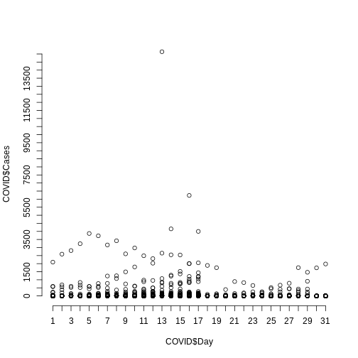
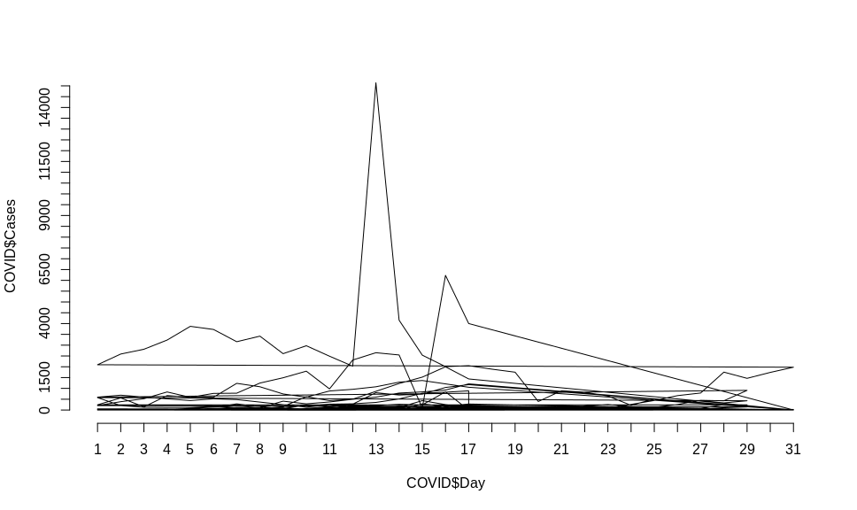
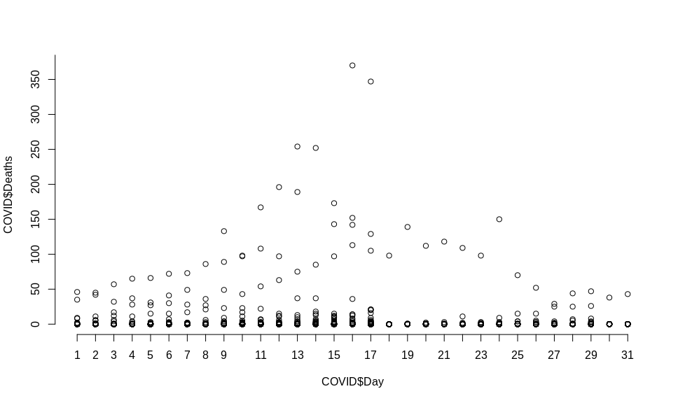
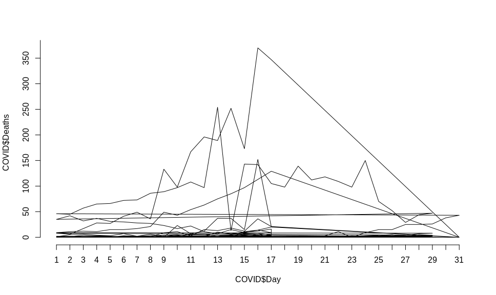
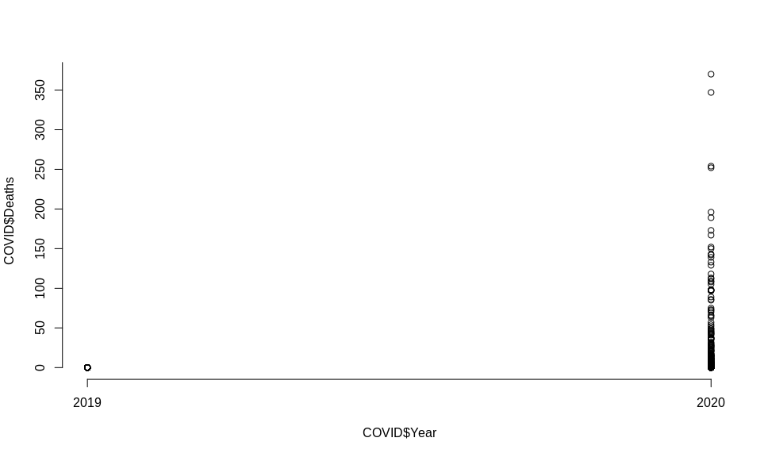
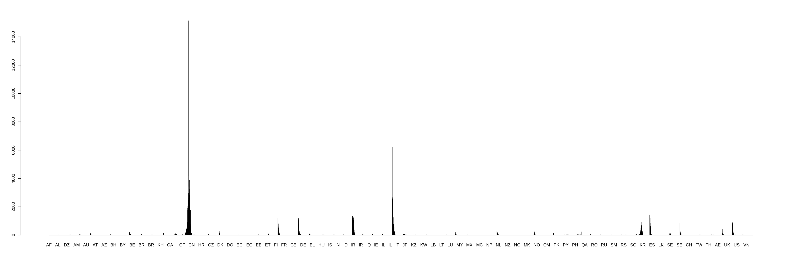
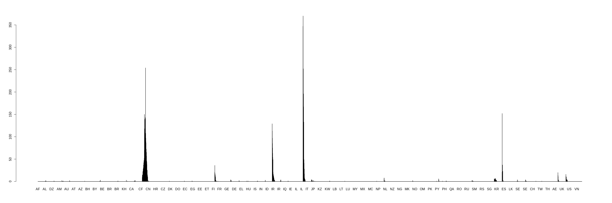

# Trabalho1-Estatística
Author: "GabrielPassos"
## Resolução para o trabalho solicitado durante a paralisação da faculdade.

1) Resumindo os dados em 'casos' por dia:

a) avalie a envolução do contágio.

b) Faça gráficos, calcule medias de posição e dispersão e analise.
<br><br>
Como solicitado nesta questão, devemos separar os casos por dia.

## Item A:
A opção que achei mais viável para analisar a evolução do contágio foi obtida criando o seguinte gráfico:
```r
 plot(x = COVID$Day, y = COVID$Cases, axes= FALSE)
 axis(side=1, at=c(1:31))
 axis(side=2, at=seq(0, 15141, by=500))
```
<b>Plot que mostra a concentração de Casos x Dias --></b>

<br>
<b>Explicação do gráfico:</b> 
<br>
Temos o plot gerado pleo código acima, no qual o eixo X representa os dias de infecção no mundo cronologicamente (todos os países entram nesses dias) e no eixo Y possuímos o número de casos de infectados no mundo todo.
<br>
Analisando o gráfico, percebemos que até o dia 15, a concentração de "bolinhas" tendem a aumentar exponencialmente, chegando até mesmo ao maior número de casos registrados (15141), (pode ser visto por "bolinhas" cada vez mais escuras a medida que o valor do eixo X tende ao valor 15) mostrando que o número de casos tende a aumentar de forma exponencial até o dia 15 da tabela fornecida. <br> Porém após o dia 15 (pico da epidemia nos países) o número de infectados tende a diminuir, proveniente da resguarda da população e, quem sabe, de medidas tomadas pelo governo. 


## Item B:
# Primeira Parte:
<b>Plot que mostra a concentração de Casos x Dias:</b>
```r
   plot(x = COVID$Day, y = COVID$Cases, axes= FALSE)
   axis(side=1, at=c(1:31))
   axis(side=2, at=seq(0, 15141, by=500))
```

<br>
<b>Plot que mostra o crescimento e decrescimento de Casos x Dias: (mostra muito bem o aumento exponencial até o dia 15 e decrescimento após o dia 15 dito no item A) </b>
```r
   plot(x = COVID$Day, y = COVID$Cases, axes= FALSE, type = "l")
   axis(side=1, at=c(1:31))
   axis(side=2, at=seq(0, 15141, by=500))
```

<br>
<b>Plot que mostra a concentração de Mortes x Dias:</b>
```r
   plot(x = COVID$Day, y = COVID$Deaths, axes= FALSE)
   axis(side=1, at=c(1:31))
   axis(side=2, at=seq(0, 15141, by=50))
```

<br>
<b>Plot que mostra o crescimento e decrescimento de Mortes x Dias:</b>
```r
   plot(x = COVID$Day, y = COVID$Deaths, axes= FALSE, type = "l")
   axis(side=1, at=c(1:31))
   axis(side=2, at=seq(0, 15141, by=50))
```

<br>
<b>Plot que mostra a concentração de Mortes x Ano:</b>
```r
   plot(x = COVID$Year, y = COVID$Deaths, axes= FALSE, type = "l")
   axis(side=1, at=c(2019:2020))
   axis(side=2, at=seq(0, 15141, by=50))
```

<br>
<b>Plot que mostra a concentração de Casos x País: (Por favor, dê um zoom ou visite o link, a quantidade de países é grande, logo o gráfico fica bem largo)</b>
```r
   barplot(COVID$Cases, names.arg = COVID$GeoId)
```

<br>
https://postimg.cc/0M0gVBM6 --> Link para a imagem, com uma resolucão melhor(Clique em "zoom", a qualidade da imagem ficará perfeita.)
<br>
<br>
<b>Plot que mostra a concentração de Morte x País: (Por favor, dê um zoom, a quantidade de países é grande, logo o gráfico fica bem largo)</b>
```r
   barplot(COVID$Deaths, names.arg = COVID$GeoId)
```

<br>
https://postimg.cc/bZkm022r --> Link para a imagem, com uma resolucão melhor(Clique em "zoom", a qualidade da imagem ficará perfeita.)
<br>

# Segunda Parte:
<b>Todos os resultados sao referentes ao numero de casos e de mortes ao longo dos dias, mundialmente!</b>
<br>
<br>
Em relação ao número de <b>Casos</b>:
<br>
<br>
<b>Medidas de posicao</b>:
<br>
<br>
Média: 33.43708
```r
   vector_cases <-COVID$Cases
   mean_cases <- mean(vector_cases)
   mean_cases
   [1] 33.43708
```
Mediana : 0
```r
   vector_cases <-COVID$Cases
   median_cases <- median(vector_cases)
   median_cases
   [1] 0
```
Moda : 0
```r
   getmode <- function(v){
      uniqv <- unique(v)
      uniqv[which.max(tabulate(match(v, uniqv)))]
   }
   mode_cases <- getmode(vector_cases)
   mode_cases
   [1] 0
```
<b>Explicando melhor a função da moda:</b>
<br>
<br>
De dentro para fora:
<b>match(X,unicoX)</b> -> Retorna um vetor dizendo a posição da primeira ocorrência de um elemento do vetor X (Elementos do x sem repetição) no unicoX. 
Ex:
```r
x = [0 0 0 0 0 0 1 2 3 0 0 0 3]
unicoX = [0 1 2 3]
Ex <- match(X,unicoX)
Ex
[1] 1 1 1 1 1 1 2 3 4 1 1 1 4
```
<b>tabulate(match(X,unicoX)</b> --> Conta o número de ocorrências de cada elemento distinto no vetor criado por match(X,unicoX).
Ex:
```r
Assuma que ainda temos o vetor "Ex", do exemplo passado.
Ex
[1] 1 1 1 1 1 1 2 3 4 1 1 1 4
Ex2 <- tabulate(Ex)
Ex2
[1] 9 1 1 2
```
Isso nos mostra que o número 1 se repetiu 9 vezes, o 2 se repetiu 1 vez assim como o 3 e o 4 se repetiu 2 vezes.
<b>which.max(tabulate(match(X,unicoX))</b> --> Retorna a posição do elemento maximal do vetor criado por tabulate(match(X,unicoX)).
Ex:
```r
Assuma que ainda temos o vetor "Ex2", do exemplo passado.
Ex2
[1] 9 1 1 2
Ex3 <- which.max(Ex2)
Ex3
[1] 1
```
Isso nos mostra que o maximal (9), que representa o número que mais se repetiu no vetor criado pelo comando match() (que contou a repetição de cada elemento distinto, logo o elemento que mais se repetiu (moda) aparece pela primeira vez na posição 1 do vetor x. Logo a moda nesse caso seria x[1] = 0.
<br>
<br>
<b>Medidas de dispersão</b>:
<br>
<br>
Amplitude: 
<br>
Com um calculo simples obtive a amplitude --> A = CasesMax - CasesMin = 15141 - (-9) = 15150
Variância: 95297.74
```r
   variancia_cases <- var(COVID$Cases)
   variancia_cases
   [1] 95297.74
```
Desvio Padrão: 308.7033
```r
   dp_cases <- sd(COVID$Cases)
   dp_cases
   [1] 308.7033
```
Em relação ao número de <b>Mortes</b>:
<b>Medidas de posicao</b>:
Média: 1.3183
```r
   vector_deaths <-COVID$Deaths
   mean_deaths <- mean(vector_deaths)
   mean_deaths
   [1] 1.3183
```
Mediana: 0
```r
   vector_deaths <-COVID$Deaths
   median_deaths <- mean(vector_deaths)
   median_deaths
   [1] 0
```
Moda: 0
```r
   CalcularModa <- function(X){
      unicoX <- unique(X)
      unicoX[which.max(tabulate(match(X, unicoX)))]
   }
   mode_deaths <- CalcularModa(vector_deaths)
   mode_deaths
   [1] 0
```
<b>Medidas de dispersão</b>:
Amplitude:
Com um calculo simples obtive a amplitude --> A = CasesMax - CasesMin = 370 - 0 = 370
Variância: 165.6523
```r
   variancia_deaths <- var(COVID$Deaths)
   variancia_deaths
   [1] 165.6523
```
Desvio Padrão: 308.7033
```r
   dp_deaths <- sd(COVID$Deaths)
   dp_deaths
   [1] 12.8706
```
2) Considere o numero de casos de covid-19 por país, e os dados sobre a idade média da população de cada país, existe uma correlação entre idade da população e numero de contagios?

lista dos paises com populações mais velhas: https://en.wikipedia.org/wiki/List_of_countries_by_median_age

## Resposta

Visando organizar o número de caso por País, realizei o comando "aggregate()" que agrega os valores de colunas em uma tabela (onde as colunas representam os valores solicitados, no caso a soma dos casos, dado pela "FUN = sim" em relação aos países), como mostrado abaixo:
```r
   CasosPorPais <- aggregate(x=COVID$Cases,
                 by = list(COVID$`Countries and territories`),
                 FUN = sum)
   CasosPorPais
```
Temos o seguinte output:
```r
   ##                                        Group.1     x
   ## 1                                  Afghanistan    21
   ## 2                                      Albania    51
   ## 3                                      Algeria    60
   ## 4                                      Andorra    14
   ## 5                          Antigua_and_Barbuda     1
   ## 6                                    Argentina    65
   ## 7                                      Armenia    52
   ## 8                                    Australia   375
   ## 9                                      Austria  1016
   ## 10                                  Azerbaijan    19
   ## 11                                     Bahamas     1
   ## 12                                     Bahrain   221
   ## 13                                  Bangladesh     5
   ## 14                                     Belarus    36
   ## 15                                     Belgium  1085
   ## 16                                       Benin     1
   ## 17                                      Bhutan     1
   ## 18                                     Bolivia    11
   ## 19                      Bosnia_and_Herzegovina    21
   ## 20                                      Brazil   234
   ## 21                           Brunei_Darussalam    54
   ## 22                                    Bulgaria    62
   ## 23                                Burkina_Faso    20
   ## 24                                    Cambodia    24
   ## 25                                    Cameroon     4
   ## 26                                      Canada   424
   ## 27  Cases_on_an_international_conveyance_Japan   696
   ## 28                    Central_African_Republic     1
   ## 29                                       Chile   156
   ## 30                                       China 81130
   ## 31                                    Colombia    57
   ## 32                                       Congo     1
   ## 33                                  Costa_Rica    41
   ## 34                                Cote_dIvoire     5
   ## 35                                     Croatia    56
   ## 36                                        Cuba     4
   ## 37                                      Cyprus    40
   ## 38                              Czech_Republic   344
   ## 39            Democratic_Republic_of_the_Congo     3
   ## 40                                     Denmark   932
   ## 41                          Dominican_Republic    11
   ## 42                                     Ecuador    58
   ## 43                                       Egypt   126
   ## 44                           Equatorial_Guinea     1
   ## 45                                     Estonia   205
   ## 46                                    Eswatini     1
   ## 47                                    Ethiopia     5
   ## 48                                     Finland   272
   ## 49                                      France  6633
   ## 50                                       Gabon     1
   ## 51                                     Georgia    33
   ## 52                                     Germany  6012
   ## 53                                       Ghana     6
   ## 54                                      Greece   352
   ## 55                                   Guatemala     6
   ## 56                                      Guinea     1
   ## 57                                      Guyana     4
   ## 58                                    Holy_See     1
   ## 59                                    Honduras     8
   ## 60                                     Hungary    50
   ## 61                                     Iceland   199
   ## 62                                       India   125
   ## 63                                   Indonesia   134
   ## 64                                        Iran 14991
   ## 65                                        Iraq   124
   ## 66                                     Ireland   223
   ## 67                                      Israel   260
   ## 68                                       Italy 27980
   ## 69                                     Jamaica    10
   ## 70                                       Japan   824
   ## 71                                      Jordan    16
   ## 72                                  Kazakhstan    11
   ## 73                                       Kenya     3
   ## 74                                      Kosovo     2
   ## 75                                      Kuwait   123
   ## 76                                      Latvia    36
   ## 77                                     Lebanon   120
   ## 78                                     Liberia     1
   ## 79                               Liechtenstein     7
   ## 80                                   Lithuania    17
   ## 81                                  Luxembourg    81
   ## 82                                    Malaysia   553
   ## 83                                    Maldives    13
   ## 84                                       Malta    30
   ## 85                                  Mauritania     1
   ## 86                                      Mexico    82
   ## 87                                     Moldova    29
   ## 88                                      Monaco     9
   ## 89                                    Mongolia     1
   ## 90                                     Morocco    37
   ## 91                                     Myanmar     0
   ## 92                                     Namibia     2
   ## 93                                       Nepal     1
   ## 94                                 Netherlands  1413
   ## 95                                 New_Zealand     8
   ## 96                                     Nigeria     2
   ## 97                             North_Macedonia    19
   ## 98                                      Norway  1169
   ## 99                                        Oman    24
   ## 100                                   Pakistan   187
   ## 101                                  Palestine    39
   ## 102                                     Panama    69
   ## 103                                   Paraguay     9
   ## 104                                       Peru    86
   ## 105                                Philippines   142
   ## 106                                     Poland   177
   ## 107                                   Portugal   331
   ## 108                                      Qatar   439
   ## 109                                    Romania   184
   ## 110                                     Russia    93
   ## 111                                     Rwanda     5
   ## 112                                Saint_Lucia     2
   ## 113           Saint_Vincent_and_the_Grenadines     1
   ## 114                                 San_Marino   102
   ## 115                               Saudi_Arabia   133
   ## 116                                    Senegal    27
   ## 117                                     Serbia    57
   ## 118                                 Seychelles     4
   ## 119                                  Singapore   243
   ## 120                                   Slovakia    84
   ## 121                                   Slovenia   253
   ## 122                                    Somalia     1
   ## 123                               South_Africa    62
   ## 124                                South_Korea  8320
   ## 125                                      Spain  9191
   ## 126                                  Sri_Lanka    29
   ## 127                                      Sudan     1
   ## 128                                   Suriname     1
   ## 129                                     Sweden  1121
   ## 130                                Switzerland  2200
   ## 131                                     Taiwan    67
   ## 132                                   Thailand   177
   ## 133                                       Togo     1
   ## 134                        Trinidad_and_Tobago     5
   ## 135                                    Tunisia    20
   ## 136                                     Turkey    47
   ## 137                                    Ukraine     5
   ## 138                       United_Arab_Emirates    98
   ## 139                             United_Kingdom  1543
   ## 140                United_Republic_of_Tanzania     1
   ## 141                   United_States_of_America  4661
   ## 142                                    Uruguay    29
   ## 143                                 Uzbekistan     8
   ## 144                                  Venezuela    33
   ## 145                                    Vietnam    61
```
Porém, como estamos interessados nos países com o maior número de casos, temos que inverter esse output. Para isso, o comando utilizado foi:
```r
   CasosPorPais <- CasosPorPais[order(CasosPorPais[,2]), TRUE]
   CasosPorPais
```
Que ordena a tabela,por número de casos de forma crescente, "CasosPorPais" pela coluna 2, no caso o x. Porém, ainda estamos com o maior número de casos no fim da tabela. Para ordenar de forma decrescente o comando utilizado foi:
```r
   CasosPorPais <- CasosPorPais[order(x, decreasing = TRUE),]
   CasosPorPais
                                          Group.1     x
   30                                       China 81130
   68                                       Italy 27980
   64                                        Iran 14991
   125                                      Spain  9191
   124                                South_Korea  8320
   49                                      France  6633
   52                                     Germany  6012
   141                   United_States_of_America  4661
   130                                Switzerland  2200
   139                             United_Kingdom  1543
   94                                 Netherlands  1413
   98                                      Norway  1169
   129                                     Sweden  1121
   15                                     Belgium  1085
   9                                      Austria  1016
   40                                     Denmark   932
   70                                       Japan   824
   27  Cases_on_an_international_conveyance_Japan   696
   82                                    Malaysia   553
   108                                      Qatar   439
   26                                      Canada   424
   8                                    Australia   375
   54                                      Greece   352
   38                              Czech_Republic   344
   107                                   Portugal   331
   48                                     Finland   272
   67                                      Israel   260
   121                                   Slovenia   253
   119                                  Singapore   243
   20                                      Brazil   234
   66                                     Ireland   223
   12                                     Bahrain   221
   45                                     Estonia   205
   61                                     Iceland   199
   100                                   Pakistan   187
   109                                    Romania   184
   106                                     Poland   177
   132                                   Thailand   177
   29                                       Chile   156
   105                                Philippines   142
   63                                   Indonesia   134
   115                               Saudi_Arabia   133
   43                                       Egypt   126
   62                                       India   125
   65                                        Iraq   124
   75                                      Kuwait   123
   77                                     Lebanon   120
   114                                 San_Marino   102
   138                       United_Arab_Emirates    98
   110                                     Russia    93
   104                                       Peru    86
   120                                   Slovakia    84
   86                                      Mexico    82
   81                                  Luxembourg    81
   102                                     Panama    69
   131                                     Taiwan    67
   6                                    Argentina    65
   22                                    Bulgaria    62
   123                               South_Africa    62
   145                                    Vietnam    61
   3                                      Algeria    60
   42                                     Ecuador    58
   31                                    Colombia    57
   117                                     Serbia    57
   35                                     Croatia    56
   21                           Brunei_Darussalam    54
   7                                      Armenia    52
   2                                      Albania    51
   60                                     Hungary    50
   136                                     Turkey    47
   33                                  Costa_Rica    41
   37                                      Cyprus    40
   101                                  Palestine    39
   90                                     Morocco    37
   14                                     Belarus    36
   76                                      Latvia    36
   51                                     Georgia    33
   144                                  Venezuela    33
   84                                       Malta    30
   87                                     Moldova    29
   126                                  Sri_Lanka    29
   142                                    Uruguay    29
   116                                    Senegal    27
   24                                    Cambodia    24
   99                                        Oman    24
   1                                  Afghanistan    21
   19                      Bosnia_and_Herzegovina    21
   23                                Burkina_Faso    20
   135                                    Tunisia    20
   10                                  Azerbaijan    19
   97                             North_Macedonia    19
   80                                   Lithuania    17
   71                                      Jordan    16
   4                                      Andorra    14
   83                                    Maldives    13
   18                                     Bolivia    11
   41                          Dominican_Republic    11
   72                                  Kazakhstan    11
   69                                     Jamaica    10
   88                                      Monaco     9
   103                                   Paraguay     9
   59                                    Honduras     8
   95                                 New_Zealand     8
   143                                 Uzbekistan     8
   79                               Liechtenstein     7
   53                                       Ghana     6
   55                                   Guatemala     6
   13                                  Bangladesh     5
   34                                Cote_dIvoire     5
   47                                    Ethiopia     5
   111                                     Rwanda     5
   134                        Trinidad_and_Tobago     5
   137                                    Ukraine     5
   25                                    Cameroon     4
   36                                        Cuba     4
   57                                      Guyana     4
   118                                 Seychelles     4
   39            Democratic_Republic_of_the_Congo     3
   73                                       Kenya     3
   74                                      Kosovo     2
   92                                     Namibia     2
   96                                     Nigeria     2
   112                                Saint_Lucia     2
   5                          Antigua_and_Barbuda     1
   11                                     Bahamas     1
   16                                       Benin     1
   17                                      Bhutan     1
   28                    Central_African_Republic     1
   32                                       Congo     1
   44                           Equatorial_Guinea     1
   46                                    Eswatini     1
   50                                       Gabon     1
   56                                      Guinea     1
   58                                    Holy_See     1
   78                                     Liberia     1
   85                                  Mauritania     1
   89                                    Mongolia     1
   93                                       Nepal     1
   113           Saint_Vincent_and_the_Grenadines     1
   122                                    Somalia     1
   127                                      Sudan     1
   128                                   Suriname     1
   133                                       Togo     1
   140                United_Republic_of_Tanzania     1
   91                                     Myanmar     0
```
Porém ainda não possuimos a idade média dos países. Para isso, baixei a tabela que o professor disponibilizou no enunciado da questão e juntei com a tabela "CasosPorPais", através do comando abaixo:
```r
   IdadePorPais <- IdadeMedia$Median (Tabela do wikipedia)
   Juncao = merge(CasosPorPais, IdadePorPais, by="Group.1", all.x = TRUE) (all.x prevalece a tabela inicial "CasosPorPais", somente adicionando as intercessões das tabelas)
   Juncao
                                          Group.1   x.x  x.y
   30                                       China 81130 37.4
   68                                       Italy 27980 45.5
   64                                        Iran 14991 30.3
   125                                      Spain  9191 42.7
   124                                South_Korea  8320 41.8
   49                                      France  6633 41.4
   52                                     Germany  6012 47.1
   141                   United_States_of_America  4661 38.1
   130                                Switzerland  2200 42.4
   139                             United_Kingdom  1543 40.5
   94                                 Netherlands  1413 42.6
   98                                      Norway  1169 39.2
   129                                     Sweden  1121 41.2
   15                                     Belgium  1085 41.4
   9                                      Austria  1016 44.0
   40                                     Denmark   932 42.2
   70                                       Japan   824 47.3
   27  Cases_on_an_international_conveyance_Japan   696 40.0
   82                                    Malaysia   553 28.5
   108                                      Qatar   439 33.2
   26                                      Canada   424 42.2
   8                                    Australia   375 38.7
   54                                      Greece   352 44.5
   38                              Czech_Republic   344 42.1
   107                                   Portugal   331 42.2
   48                                     Finland   272 42.5
   67                                      Israel   260 29.9
   121                                   Slovenia   253 44.5
   119                                  Singapore   243 34.6
   20                                      Brazil   234 32.0
   66                                     Ireland   223 36.8
   12                                     Bahrain   221 32.3
   45                                     Estonia   205 42.7
   61                                     Iceland   199 36.5
   100                                   Pakistan   187 23.8
   109                                    Romania   184 41.1
   106                                     Poland   177 40.7
   132                                   Thailand   177 37.7
   29                                       Chile   156 34.4
   105                                Philippines   142 23.5
   63                                   Indonesia   134 30.2
   115                               Saudi_Arabia   133 27.5
   43                                       Egypt   126 23.9
   62                                       India   125 27.9
   65                                        Iraq   124 20.0
   75                                      Kuwait   123 29.3
   77                                     Lebanon   120 30.5
   114                                 San_Marino   102 44.4
   138                       United_Arab_Emirates    98 30.3
   110                                     Russia    93 39.6
   104                                       Peru    86 28.0
   120                                   Slovakia    84 40.5
   86                                      Mexico    82 28.3
   81                                  Luxembourg    81 39.3
   102                                     Panama    69 29.2
   131                                     Taiwan    67 40.7
   6                                    Argentina    65 31.7
   22                                    Bulgaria    62 42.7
   123                               South_Africa    62 27.1
   145                                    Vietnam    61 30.5
   3                                      Algeria    60 28.1
   42                                     Ecuador    58 27.7
   31                                    Colombia    57 30.0
   117                                     Serbia    57 42.6
   35                                     Croatia    56 43.0
   21                           Brunei_Darussalam    54 30.2
   7                                      Armenia    52 35.1
   2                                      Albania    51 32.9
   60                                     Hungary    50 42.3
   136                                     Turkey    47 30.9
   33                                  Costa_Rica    41 31.3
   37                                      Cyprus    40 36.8
   101                                  Palestine    39 33.4
   90                                     Morocco    37 29.3
   14                                     Belarus    36 40.0
   76                                      Latvia    36 43.6
   51                                     Georgia    33 38.1
   144                                  Venezuela    33 28.3
   84                                       Malta    30 41.8
   87                                     Moldova    29 36.7
   126                                  Sri_Lanka    29 32.8
   142                                    Uruguay    29 35.0
   116                                    Senegal    27 18.8
   24                                    Cambodia    24 25.3
   99                                        Oman    24 25.6
   1                                  Afghanistan    21 18.8
   19                      Bosnia_and_Herzegovina    21 42.1
   23                                Burkina_Faso    20 17.3
   135                                    Tunisia    20 31.6
   10                                  Azerbaijan    19 31.3
   97                             North_Macedonia    19 37.9
   80                                   Lithuania    17 43.7
   71                                      Jordan    16 22.5
   4                                      Andorra    14 44.3
   83                                    Maldives    13 28.2
   18                                     Bolivia    11 24.3
   41                          Dominican_Republic    11 28.1
   72                                  Kazakhstan    11 30.6
   69                                     Jamaica    10 26.0
   88                                      Monaco     9 53.1
   103                                   Paraguay     9 28.2
   59                                    Honduras     8 23.0
   95                                 New_Zealand     8 37.9
   143                                 Uzbekistan     8 28.6
   79                               Liechtenstein     7 43.2
   53                                       Ghana     6 21.1
   55                                   Guatemala     6 22.1
   13                                  Bangladesh     5 26.7
   34                                Cote_dIvoire     5 36.5
   47                                    Ethiopia     5 17.9
   111                                     Rwanda     5 19.0
   134                        Trinidad_and_Tobago     5 36.0
   137                                    Ukraine     5 40.6
   25                                    Cameroon     4 18.5
   36                                        Cuba     4 41.5
   57                                      Guyana     4 26.2
   118                                 Seychelles     4 35.4
   39            Democratic_Republic_of_the_Congo     3 19.7
   73                                       Kenya     3 19.7
   74                                      Kosovo     2 29.1
   92                                     Namibia     2 21.2
   96                                     Nigeria     2 18.4
   112                                Saint_Lucia     2 34.8
   5                          Antigua_and_Barbuda     1 31.9
   11                                     Bahamas     1 32.0
   16                                       Benin     1 18.2
   17                                      Bhutan     1 27.6
   28                    Central_African_Republic     1 19.7
   32                                       Congo     1 19.7
   44                           Equatorial_Guinea     1 19.8
   46                                    Eswatini     1 21.7
   50                                       Gabon     1 18.6
   56                                      Guinea     1 18.9
   58                                    Holy_See     1 23.0
   78                                     Liberia     1 17.8
   85                                  Mauritania     1 20.5
   89                                    Mongolia     1 28.3
   93                                       Nepal     1 24.1
   113           Saint_Vincent_and_the_Grenadines     1 33.6
   122                                    Somalia     1 18.1
   127                                      Sudan     1 19.9
   128                                   Suriname     1 29.8
   133                                       Togo     1 19.8
   140                United_Republic_of_Tanzania     1 17.7
   91                                     Myanmar     0 17.2


```
Agora sim podemos analisar a influência da idade média em relação ao número de casos nos países. Sabendo que a idade média mundial é de 30.4 anos, todos os países mais afetados pelo COVID-19 estão acima da média mundial, com excessão do Irã, que tem 30,3, quase a média. Porém analisando melhor, os países que estão sendo mais afetados são exatamente aqueles que tem uma população com a idade média acima de 40 anos e aqueles que tem uma idade média abaixo de 30 anos estão sendo pouco afetados.
<br>


